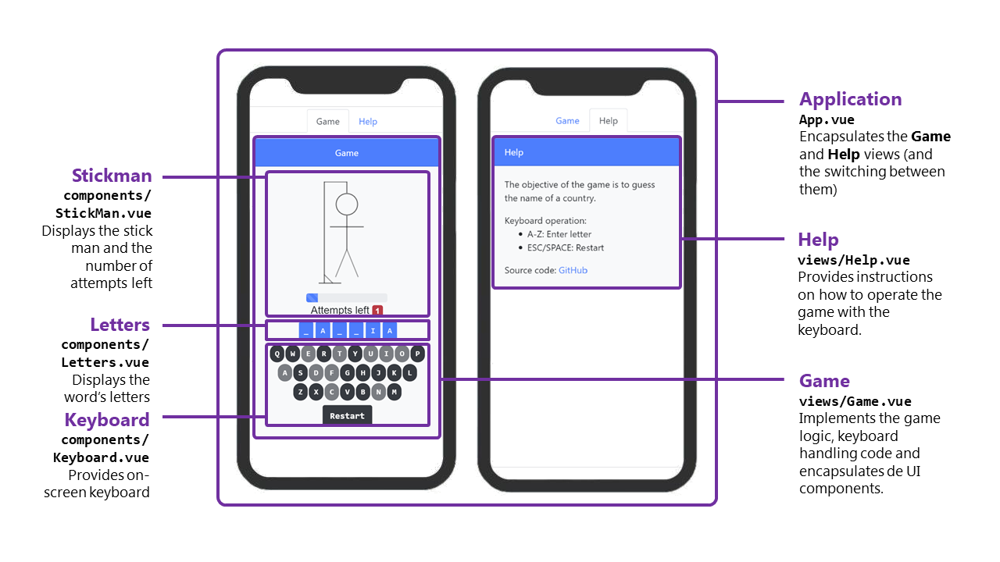
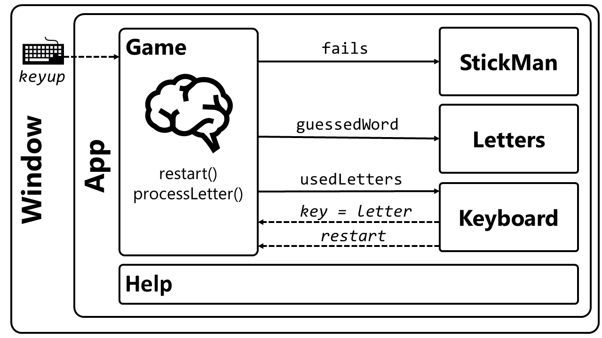

# Writing a Hangman Game in Vuejs

This is a project-orientated [Vue.js](https://vuejs.org/) and [Bootstrap Vue](https://bootstrap-vue.js.org/) demonstration. The project is a mobile-first (but also desktop-friendly) Hangman game. The game can be played [here](http://egarbarino.github.io/vuejs-hangman/). 

The game demonstrates the following capabilities:

* Single Page Application (SPA)
* Responsive UI thanks to Bootstrap
* Keyboard operation on Desktop
* Touch operation on mobile
* Downstream and upstream component communication

# Why Vue.js?

Luckily, Vue.js is outside the "framework wars"; it does not aim to be a more powerful alternative to React or Angular. Its objective is being _approachable:_ "let's get developers up and running in a short time and only add complexity when and if needed" 

This project should prove Vue.js' low ceremony approach to building Single Page Applications (SPAs).

# Getting Started

Vue.js can be used as a simple script import from a CDN without the need of any further boilerplate. In our case, though, the Hangman game aims to demonstrate the skeleton of a more industrial application so we will be using a workflow based on NPM and the Vue CLI. 

The required packages are `vue`, `@vue/cli`, `vue-router`, `bootstrap-vue`, and `bootstrap`:

```
npm install -g vue

npm install -g @vue/cli

npm install -g vue-router

npm install -g bootstrap-vue bootstrap
```

A template project is configured using the `vue create <PROJECT>` command which will present the option of using a default preset or selecting features manually. We should select the manual option: 

```
$ vue create vuejs-hangman
Vue CLI v3.11.0
? Please pick a preset:
  default (babel, eslint)
> Manually select features
```

On the menu selection, we should tick the `Router` item which is used by our Hangman game to implement multiple views:

```
Vue CLI v3.11.0
? Please pick a preset: Manually select features
? Check the features needed for your project:
 (*) Babel
 ( ) TypeScript
 ( ) Progressive Web App (PWA) Support
>(*) Router
 ( ) Vuex
 ( ) CSS Pre-processors
 (*) Linter / Formatter
 ( ) Unit Testing
 ( ) E2E Testing
```

We can then modify the project and see changes on the web browser, in real time, as follows:

```
cd vuejs-hangman

npm run serve
```

Please note that the finished project published on [GitHub](https://www.github.com/egarbarino/vuejs-hangman) does not require the `vue create` nor the package installation part. If cloning the GitHub project, we jump straight to `npm run serve`.

# High-level Architecture

## Component Overview

The foundational building block in Vue.js is called a _component_. Components encapsulate HTML, JavaScript and CSS. 

``` html 
<template>
<!-- Component's HTML goes here -->
</template>

<script>
// Component's JavaScript goes here
export default {
  name: 'component'
}
</script>

<style scoped>
/* Component's CSS goes here */
</style>
```

In our application, we have defined six components in total.



The components are as follows:

1. App.vue: The top-most component that embeds the _Game_ and _Help_ views.
2. views/Game.vue: The component that implements the game logic and embeds the _StickMan_, _Letters_, and _Keyboard_ components.
3. views/Help.vue: Instructions.
4. components/StickMan.vue: The component that renders the stick man and game progress.
5. components/Letters.vue: The component that renders the current word being guessed.
6. components/Keyboard.vue: The component that displays the on-screen keyboard.

The convention is to store components that are bound to a given URI under `src/views` whereas atomic components go under `src/components`.

## Component Communication

Components communicate with one another to exchange data. Components that receive _input_ data declare such data using so-called _props_. For example, the `Letter.vue` component declares a prop called `letters` of type `String`:

``` html
<script>
export default {
  name: 'Letters',
  props: {
    letters: String 
  }
}
</script>
```

Now, all components that use the `Letter` component can set the `letters` prop. For instance:

``` html
<Letters letters="CHILE"/>
```

If we want to assign `letters` to a JavaScript variable, we use the _bind_ syntax instead:

``` html
<Letters bind:letters="js_variable"/>
```

or

``` html
<Letters :letters="js_variable"/>
```

The `js_variable` may be a _prop_, an attribute returned by the `data()` method, or a compute value, among others.

``` javascript 
export default {
  name: 'Letters',
  props: {
    // Set by the component's user! :) 
    // <Letters js_variable_as_a_prop="CHILE"/>
    js_variable_as_a_prop: String 
  },
  data() {
    return {
      js_variable_as_data: "CHILE";
    }
  },
  computed: {
    js_variable_as_computed() : {
      return "CHILE";
    }
  }
}
```
In addition, components may _output_ data via events using the `emit('event_name',payload)` method. For example, the `Keyword` component notifies of key presses on the on-screen keyboard as follows:  

``` javascript 
this.$emit('key',key);
```

The below picture shows how the Hangman's components communicate using props (solid lines) and events (dashed lines):



The table below shows how the approach used for each communication line together with an example:  

Component        | Type        |  Description              | Example
-----------------|-------------|---------------------------|--------
Window -> Game   | Js event    | `keyup` JavaScript event  | 'C'
Game -> StickMan | props       | `fails` (Integer)         | 3
Game -> Letters  | props       | `guessedWord` (String)    | 'CHIL_' 
Game -> Keyboard | props       | `usedLettrs` (String)     | 'AEIOCIL'
Keyboard -> Game | Vue event   | key -> letter (String)    | 'C'
Keyboard -> Game | Vue event   | restart                   | n/a

